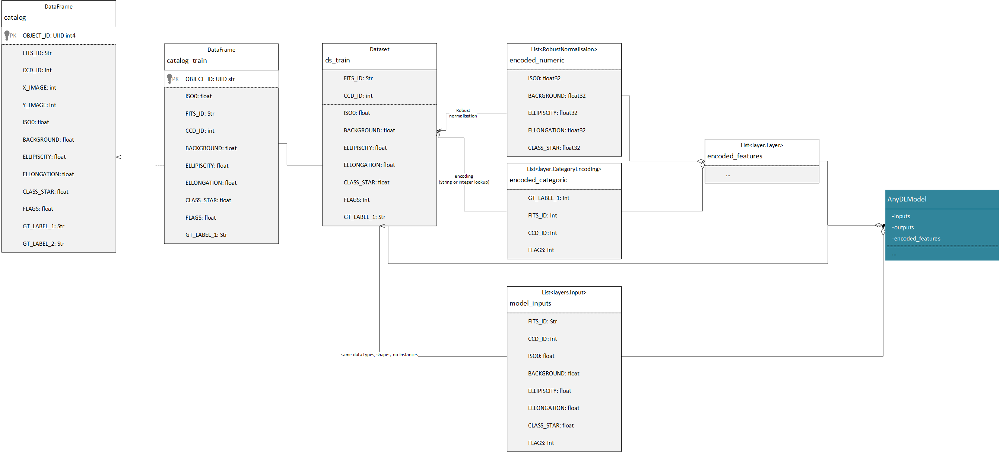

# Data Pipeline for Deep Learning Models

### Overview

The data pipeline used to train and evaluate the deep learning models ingests the bronze catalogs and transforms them into TensorFlow datasets. The pipeline is designed to handle the data efficiently and prepare it for model training and evaluation. 

A critical point in the pipeline is the use of a long buffer for shuffling the data. 
Although data are shuffled in the bronze catalog (by using numpy), the shuffling is not sufficient for training deep learning models.
As many objects are extracted from the same image, hundreds or thousands of objects, it seems that even after shuffling the TF datasets with a buffer size of 10K keep strong correlations between the objects leading to poor training results.
The long buffer size is set to 100K, which is sufficient to ensure that the data is well shuffled and that the model can learn effectively from the training data.
The impact of the buffer size on the training results is demonstrated in the report "DCN: The importance of the buffer size for shufling data".

## UML Diagram
The data pipeline diagram  is provided in the file AIQ_algorithm_data_flow.vsdx