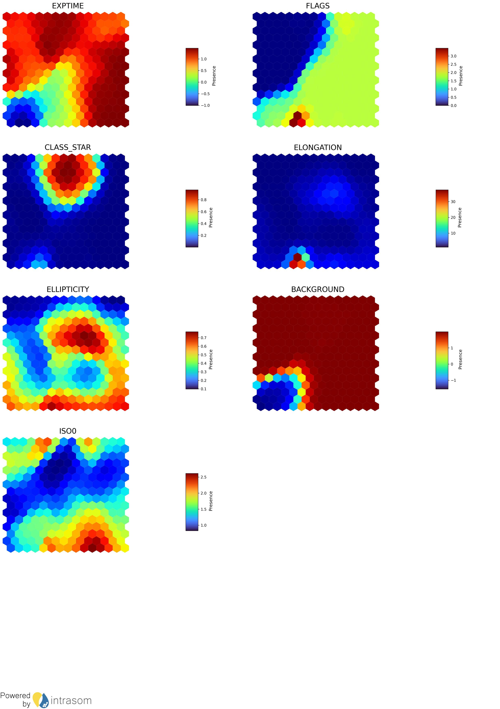
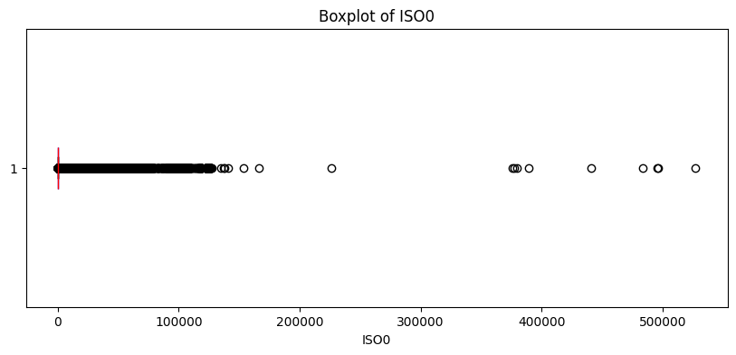

# Data Report

This document provides a summary of the data used in the project, including its sources, processing steps, and key characteristics.
It serves as a reference for understanding the data's structure and quality, as well as its relevance to the project's objectives.

## Data exploration with Self Organizing Map (SOM)

The data used in the exploration with SOM are the parquet catalogs containing the sources extracted from the images.
The quality labels are not used in this exploration. 

The exploration is done in notebooks "evaluating_clusters_classification_power.ipynb" and "SOM_clustering.ipynb".
The results of the exploration are stored in the directory "data/clustering/Plots" and "data/clustering/Results".

The results in the plot figure  clearly show that the selected features are relevant to classify the sources. 

**The U-matrix plot show significant differences between the clusters, with a potential for classifying the image quality into 2 or more categories.**

## General summary of the data

## Data quality summary

The data quality of bronze catalogs is explored in the notebook "datasets_verification.ipynb".

For training DL models we chose to drop the columns "OBJECT_ID" and "gt_label2".
For the remaining columns, no Nan or infinite values are found.
All lines where missing values are found for "gt_label1" are dropped.

As the data sources are heteroclitic (data from professional telescope and cameras, others from personal and amateur telescope and cameras), the data range is quite large for most of the features. We also observe a significant number of outliers in features.
As for example for the feature "ISO0", as shown in the following plot:

See the notebook "datasets_verification.ipynb" for more details.

It seems also that the feature "BACKGROUND" contains problematic values for the model training. After the sample 1873000 some values lead to Nan values in the model metrics. We looked for the possible cause of this problem but without finding an explanation.
**As a workaround, we dropped all lines after the index 1873000.** This problem requires further investigation.

## Target variable

The target variable is the quality label of the image, which is a categorical variable with 5 classes.
Regarding the workaround instaured for the feature "BACKGROUND", the number of categories is reduced to 4, with the following distribution:
{'GOOD': 0.5989620465839595, 'RBT': 0.19793362733891753, 'BT': 0.14426418975966473, 'B_SEEING': 0.058840136317458235}

## About the classification power of the features

The earlier exploration with Deep learning modeling has shown an excellent classification power of the features.

