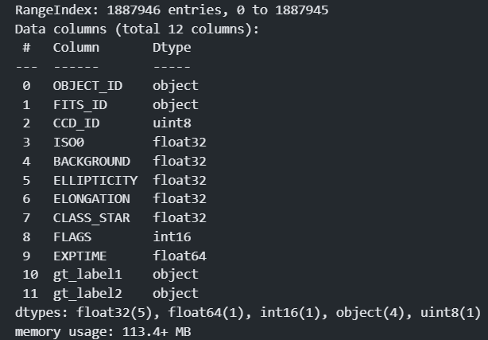

# Data Dictionaries
_Place to put data description documents, typically received from a client_
This is typically a field-level description of data files received.

This document provides the descriptions of the data that is provided by the client. If the client is providing data dictionaries in text (in emails or text files), directly copy them here, or have a snapshot of the text, and add it here as an image. If the client is providing data dictionaries in Excel worksheets, directly put the Excel files in this directory, and add a link to this Excel file.

If the client is providing you the data from a database-like data management system, you can also copy and paste the data schema (snapshot) here. If necessary, please also provide brief description of each column after the snapshot image, if such image does not have such information. 

## <Parquet bronze catalogs\>

Merged catalog from several parquet files at bronze state
catalog_paths = [
        os.path.join(fm_path, "objects_catalog_cadc_bronze.parquet.gz"),
        os.path.join(fm_path, "objects_catalog_ngc0869_bronze.parquet.gz"),
        os.path.join(fm_path, "objects_catalog_ngc0896_bronze.parquet.gz"),
        os.path.join(fm_path, "objects_catalog_ngc7000_bronze.parquet.gz")
    ]
These data are available at the url https://huggingface.co/datasets/selfmaker/astro_iqa.

The following figure described the variables and data types of the merged catalog:

Annotations follow the COCO format:
"info": {
        ...
    },
    "images": [
        filenames, ...
    ],
    "categories": [
        "GOOD",
        "B_SEEING",
        "BGP",
        "BT",
        "RBT"
    ],
    "annotations": { ... }
Annotations files are located in the fold "data/for_modeling". The ones used to compose the current dataset are:
- map_images_labels_cadc2.json
- map_images_labels_ngc0869.json
- map_images_labels_ngc0896.json
- 8595 map_images_labels_ngc7000.json

Annotations are already reported in the parquet files.

## <Tensorflow datasets\>

Tensorflow datasets are used to train and evaluate the deep learning models.
They are the transformation of the previously described catalogs to tf.data.Dataset format, produced with functions of the module dnn_datasets_preparation.py.
They are formatted as (features, label) tuples, where label is "gt_label1".
