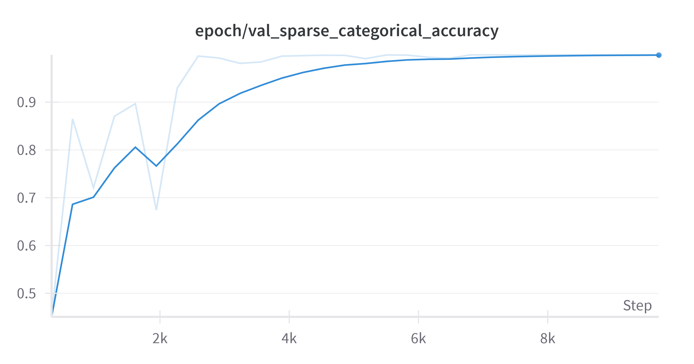
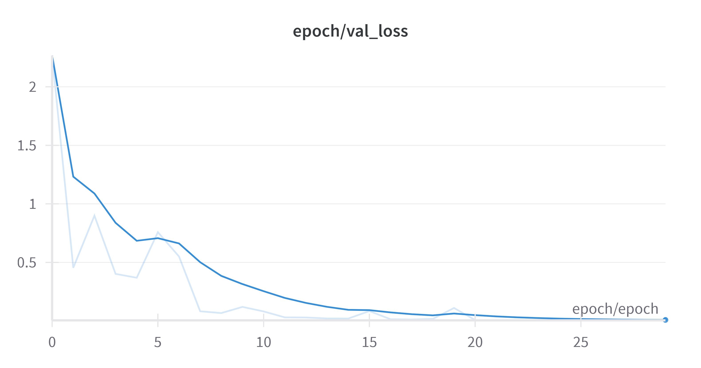
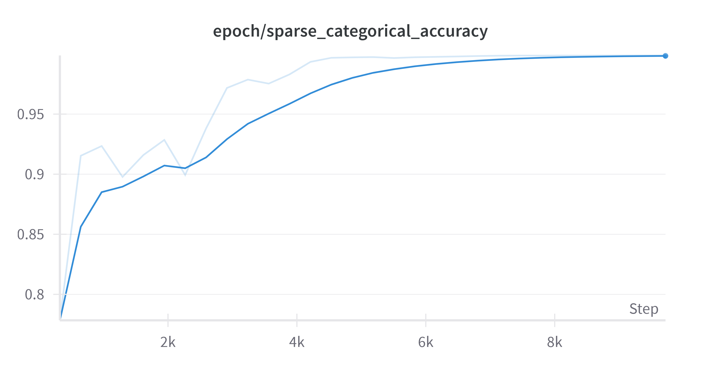
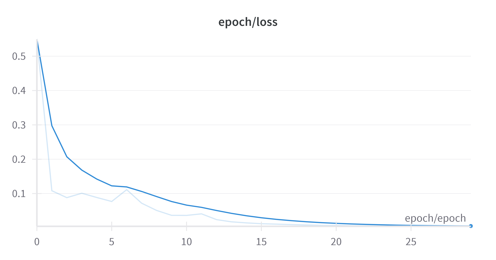
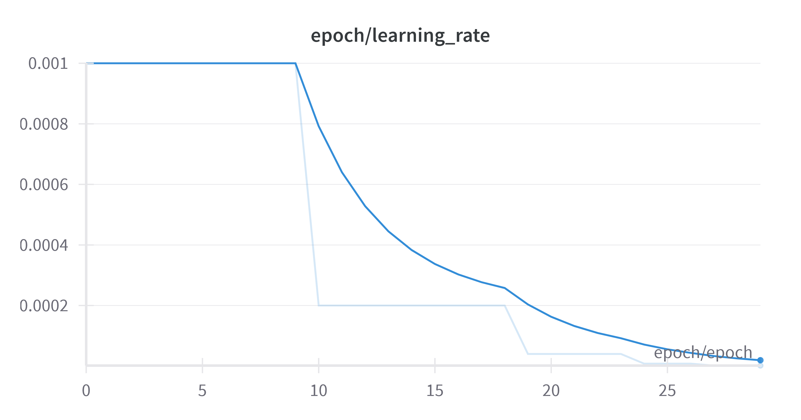

# Model Report
Brief report on the simple DNN creation, training and evaluation.

## Analytic Approach
* Target definition: "gt_label1" with (currently) 4 categories
* The numerical inputs are:
	* "ISO0": "float32",
    * "BACKGROUND": "float32",
    * "ELLIPTICITY": "float32",
    * "ELONGATION": "float32",
    * "CLASS_STAR": "float32",
    * "EXPTIME": "float32"
* The categorical inputs are:
	* "FITS_ID": "string",
    * "CCD_ID": "uint8",
    * "FLAGS": "int16",
* Features encoding
	* for numerical features, the data are normalized with the class RobustNormalisation regarding the median and the interquartile range, to reduce the influence of outliers
	* for categorical features, the data are encoded either with StringLookup or IntegerLookup.
* Type of model built: A simple DNN with N hidden dense layers.

## Model Description

* Models and Parameters

	* Description: The model is defined in the function create_dcn_model of the module nn_modeling. It is composed of a DCN V2 (from the TF TFRS module) and a simple DNN. It can be configured as a stack of dcn with dnn, or as a concatenation of dcn with dnn. Each layer is configured with ReLu activation and L2 regularisation and followed by a batch normalisation. A dropout layer is stacked on top and the output layer is a softmax layer with 4 classes.
	* The loss function is the categorical cross entropy, and the optimizer is Adam.
	* A callback ReduceLROnPlateau is used to reduce the learning rate when the validation accuracy does not improve for 3 epochs.
	* Learner hyper-parameters
		* batch_size:4,096
		* dcn_dnn:"stack"
		* decay_steps:1,000
		* dropout:0.3
		* end_lr:0.0001
		* initial_lr:0.001
		* l2:0.008
		* num_classes:5
		* num_cross_layers:1
		* num_epochs:30
		* num_hidden_layers:1
		* num_units:64
		* shuffling_size:100,000

## About the hyper-parameters importance

A quick exploration of the hyper-parameters importance has been made and has shown that:
1- The shuffling size has a very huge impact on the model performance.
2- L2 regularisation has a bigger impact than other hyper-parameters. Few tests have shown that 0.008 is a good value.
3- The number of hidden layers and the number of units in each layer are not very important. 

## Results (Model Performance)

Results obtained for the run [vivid-smoke-59](https://wandb.ai/mike-fournigault1/astro_iqa/runs/6u2jqakm/overview) (monitored in W&B) with the config parameters listed above.

With only 30 epochs, the model shows a very good performance on the training, validation and testing datasets.
The overall performances are:
* epoch/epoch:29
* epoch/learning_rate:0.00000160000013238459
* epoch/loss:0.004612763877958059
* epoch/sparse_categorical_accuracy:0.9988406896591188
* epoch/val_loss:0.0052195824682712555
* epoch/val_sparse_categorical_accuracy:0.9989777207374572

## Model Understanding

* Variable Importance (significance)
	To be investigated

* Insight Derived from the Model
	To be investigated

## Conclusion and Discussions for Next Steps

* Conclusion
Very good performances are obtained during the training and validation phases. The model is not overfitting, and the accuracy is very good. Similar performances are obtained on the test dataset.
Although we implemented only one Cross layer, it seems to be enough to learn the interactions between the few features.
The DNN stacked on top also contains only one layer.
Tests have shown that performance are better (3% better on accuracy) with a DNN stacked on top of the DCN than with a concatenation of the two models.
30 epochs are enough to reach a good performance.

* What other Features Can Be Generated from the Current Data
	To be investigated

* What other Relevant Data Sources Are Available to Help the Modeling
	To be investigated