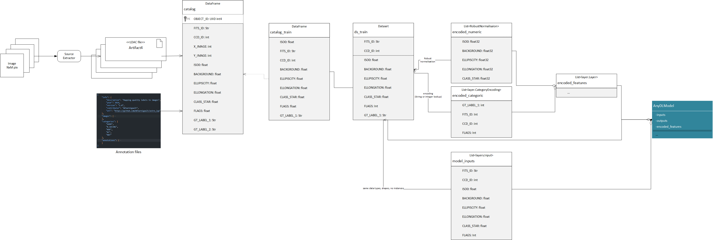
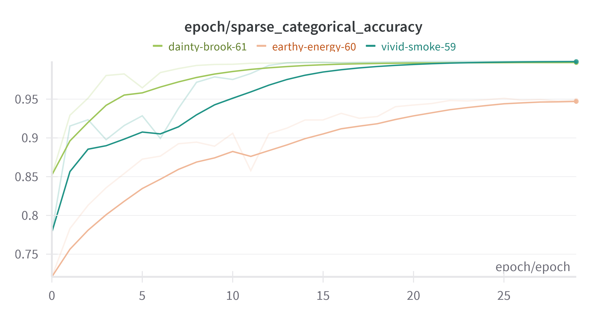

# Final Model Report

## Analytic Approach
* Target definition: "gt_label1" with (currently) 4 categories
* The numerical inputs are:
	* "ISO0": "float32",
    * "BACKGROUND": "float32",
    * "ELLIPTICITY": "float32",
    * "ELONGATION": "float32",
    * "CLASS_STAR": "float32",
    * "EXPTIME": "float32"
* The categorical inputs are:
	* "FITS_ID": "string",
    * "CCD_ID": "uint8",
    * "FLAGS": "int16",
* Features encoding
	* for numerical features, the data are normalized with the class RobustNormalisation regarding the median and the interquartile range, to reduce the influence of outliers
	* for categorical features, the data are encoded either with StringLookup or IntegerLookup.
* Type of model built: A DCN V2 and a simple DNN (see their respective model reports for details)

## Solution Description
* overview of architecture
To build the deeep learning models, we used Keras 3 and Tensorflow 2.17. With the TFRS module to implement the DCN V2 model.
The data pipeline ingest images, uses Sextractor to extract objects and compute their features. All the features are then compiled in a parquet catalog with pandas.
The catalogs are then transformed into Tensorflow datasets for training and evaluation.

All trained models use the same data pipeline, with the same features and datasets, the same preprocessing and encoding.

A simple DNN and a DCN model are trained and compared.

* What is output?
Both models output a probability for each of the 4 classes. The model with the best performance is selected for deployment.

## Data
See the data reports for a complete description.

## Features
See the data and model reports for a complete description.

## Algorithm

The complete data flow, from images to model training and evaluation, is described in the Figure .

See the code of nn_modeling.py for the details of the models.

The loss computed is the categorical cross entropy, and the optimizer is Adam.
The metrics used are the sparse_categorical_accuracy for training, validation and testing.
See the respective notebooks for the details of the model training and evaluation.

## Results

Many runs of experimentation have been driven and logged with W&B.
The run benchmark are available in the W&B project https://wandb.ai/mike-fournigault1/astro_iqa?nw=nwusermikefournigault1.

See the model reports for the details of the models and their performances.

Overall, the models show a very good performance on the training, validation and testing datasets.
The DNN and DCN models show similar performances, with a slight advantage for the DCN model.
See the figure  for the comparison of the models performances.

Run "vivid-smoke-59" (DCN) is the best run for a DCN model in the stacked configuration.
Run "dainty-brook-61" (DNN) is the best run for a DNN model.
Run "earthy-energy-60" (DCN) is the best run for a DCN model in the concatenated configuration.

We can see a significant advantage of the DCN model in the stacked configuration over the concatenated configuration.

The accuracy / loss for validation and test datasets show a very good performance, with no overfitting.

